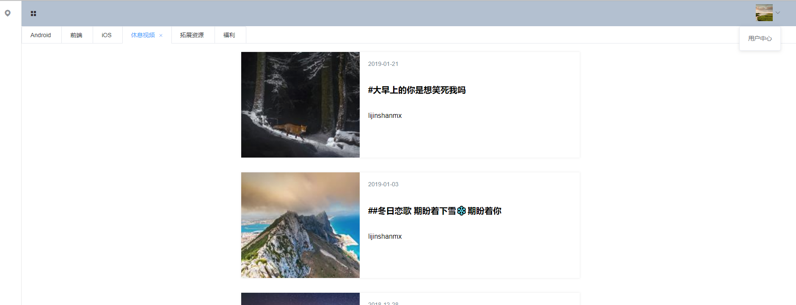

## vue-admin-frame

Simple vue admin frame demo, use vue2.0, element-ui .

## Demo





## Project setup
```
npm install
```

## Compiles and hot-reloads for development
```
npm run serve
```

## use libs

```
    "axios": "^0.18.0",
    "element-ui": "^2.5.4",
    "lodash": "^4.17.11",
    "vue": "^2.6.6",
    "vue-progressbar": "^0.7.5",
    "vue-router": "^3.0.1",
    "vuex": "^3.0.1"
	
```

## reduce build size

1. cdn
2. zip
3. lasy router

- [vue-cli 3.0 build包太大导致首屏过长的解决方案](https://www.jianshu.com/p/d1fb954f5713?utm_source=oschina-app)
- [Vue项目优化——使用CDN减小代码体积加快请求速度](https://blog.csdn.net/u014231144/article/details/83791877)
- [Vue -- vue-cli(vue脚手架) npm run build打包优化](https://www.cnblogs.com/donghuang/p/10042812.html)


## pm2 startup 

- pm2 start && pm2 save && pm2 startup